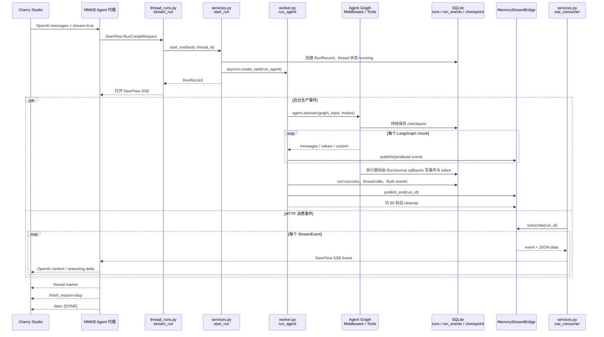

# MMKB Agent 存储配置、SSE 与 OOM 排查指南

## 文档目的

本文说明 DeerFlow 与 MMKB Agent 链路中的存储布局、可配置边界，以及以下公网
部署故障的现象、当前代码事实、可能原因、排查方法和修复建议：

1. 用户通过 Cherry Studio 调用公网 MMKB 的 `model=agent`；
2. Agent 已经输出正文和 `[agent-thread: ...]`；
3. Cherry Studio 的回复进度条仍持续滚动；
4. 一段时间后公网服务器内存耗尽，SSH、MMKB 等服务均无法访问。

目前还不能仅凭该现象断定 OOM 一定由 DeerFlow 引起。最终结论必须结合公网
服务器的 OOM 日志、容器内存变化、DeerFlow run 状态和 MMKB 请求日志确认。

本文重点区分三类容易混淆的配置：

- **持久化配置**：决定 checkpoint、run、run event、memory 等数据写到哪里；
- **数据体积配置**：限制部分记录、提示词或工具输出大小，但不直接限制进程内存；
- **运行资源配置**：控制 worker、队列和容器资源，通常不在 `config.yaml` 中。

## 当前链路

```text
Cherry Studio
  -> MMKB /v1/chat/completions model=agent
  -> DeerFlow /api/threads/{thread_id}/runs/stream
  -> 后台 Agent run
  -> DeerFlow SSE
  -> MMKB 转换为 OpenAI Chat Completions SSE
  -> Cherry Studio
```

MMKB 正常结束一次流式响应时，输出顺序为：

```text
退出 DeerFlow 上游 SSE 循环
  -> 输出可选的 token usage
  -> 输出 [agent-thread: ...]
  -> 输出 finish_reason=stop
  -> 输出 data: [DONE]
```

因此，Cherry Studio 已显示 `[agent-thread: ...]` 但仍在转圈，说明客户端没有
正常识别最终结束帧，或者 MMKB 到客户端的 HTTP/SSE 连接没有正常关闭。

同时需要注意：MMKB 当前在上游发生部分网络错误或超时时，也可能继续输出
thread marker 和 `[DONE]`。所以出现 marker 只能说明 MMKB 已走到流式响应的
收尾阶段，不能单独证明 DeerFlow 后台 run 已成功完成。

## 当前存储布局与配置边界

### 当前 `run_events` 保存在哪里

当前仓库的 `config.yaml` 使用：

```yaml
database:
  backend: sqlite
  sqlite_dir: .deer-flow/data

run_events:
  backend: db
  max_trace_content: 10240
  track_token_usage: true
```

因此 `run_events` 当前写入数据库的 `run_events` 表，而不是长期保存在 Gateway
进程内存中。默认 SQLite 文件位置取决于 Gateway 的运行目录：

| 环境 | 当前默认位置 |
|---|---|
| 宿主机直接运行 backend | `backend/.deer-flow/data/deerflow.db` |
| 当前 Docker Gateway | `/app/backend/.deer-flow/data/deerflow.db` |

`run_events.backend` 支持：

| 值 | 保存位置 | 关键特性与限制 |
|---|---|---|
| `memory` | 当前 Gateway worker 的进程内存 | 重启丢失；没有自动淘汰；多 worker 之间不共享 |
| `db` | `database` 指定的 SQL 数据库 | 当前推荐；若 `database.backend: memory`，会退回内存实现 |
| `jsonl` | `.deer-flow/threads/{thread_id}/runs/{run_id}.jsonl` | 文件路径不能单独配置；序号生成只适合单进程 |

`max_trace_content` 只会截断 `category == "trace"` 的数据库事件内容，不会截断
`message` 或 `output` 事件。因此切换为数据库能够消除该部分的长期进程内存增长，
但不能阻止大事件在序列化、传输和写库时造成瞬时内存峰值，也不能自动控制数据库
文件增长。

2026-06-15 对当前本地环境的观察结果为：

| 项目 | 观察值 |
|---|---:|
| SQLite 文件大小 | 约 409 MiB |
| `run_events` 行数 | 3,464 |
| `run_events.content` 总字符数 | 约 905 万 |
| 单条最大事件 | 约 9.6 万字符 |
| 当时活跃 run | 0 |

这些数据只说明当前本地配置确实在写数据库，不代表公网部署已经同步该配置，也不
证明历史 OOM 由某个单一模块引起。部署修改后必须重启 Gateway。

### `config.yaml` 中可配置的存储内容

以下配置会直接决定数据保存后端、路径或持久化行为。完整字段说明见
[`CONFIG_YAML_REFERENCE.md`](./CONFIG_YAML_REFERENCE.md)。

| 配置块 | 保存的内容 | 可配置内容 | 当前默认或常见后端 |
|---|---|---|---|
| `database` | LangGraph checkpoint、run、thread 元数据、用户、反馈等应用数据 | `backend`、`sqlite_dir`、`postgres_url`、`echo_sql`、`pool_size` | `sqlite`、`postgres`、`memory` |
| `checkpointer` | 仅 LangGraph checkpoint；旧版兼容覆盖项 | `type`、`connection_string` | 未配置时跟随 `database` |
| `run_events` | 消息、输出、trace 与 token 使用记录 | `backend`、`max_trace_content`、`track_token_usage` | 当前为 `db` |
| `memory` | Agent 长期记忆 | `enabled`、`storage_path`、`storage_class`、防抖时间、模型、事实数量、置信度和注入 token 上限等 | 默认按用户/Agent 写 JSON 文件；可自定义存储类 |
| `skills` | 技能文件 | storage 实现、宿主机路径、容器路径 | 文件系统 |
| `tool_output` | 超过阈值的工具输出 | 外置阈值、预览长度、回退截断、`storage_subdir`、工具覆盖规则 | thread 工作目录下的文件 |
| `sandbox.mounts` | Agent 可访问的挂载文件 | 宿主机路径、容器路径和只读属性 | 文件系统或沙箱挂载 |

需要注意：

- `memory.storage_class` 是替换长期记忆读写实现，不是简单修改 JSON 字段结构；
- `memory.storage_path` 使用绝对路径时会绕过默认的按用户路径隔离，配置时必须确认
  多用户行为；
- `uploads.max_*` 只控制上传文件大小和数量，不决定上传文件保存后端；
- channel 映射当前固定写入 `{base_dir}/channels/store.json`，不能通过
  `config.yaml` 单独选择后端；
- extensions 使用独立的 JSON 配置，不属于 `config.yaml` 存储块。

### 影响数据体积或进程内存，但不改变持久化后端的配置

| 配置块 | 作用 | 不代表什么 |
|---|---|---|
| `stream_bridge.queue_maxsize` | 限制每个 run 暂存的事件条数，默认 256 | 不限制单条事件字节数，也不是数据库保留策略 |
| `summarization` | 在模型上下文过长时生成摘要 | 不限制 Gateway RSS，也不清理 run event |
| `memory.injection.max_tokens` | 限制注入系统提示词的长期记忆 token | 不限制 memory 文件总大小 |
| `tool_output` 阈值 | 将大型工具结果外置为文件并保留预览 | 不限制其他 SSE 事件或 LangGraph 状态大小 |
| `subagents.max_turns`、`timeout_seconds` | 限制子 Agent 执行规模 | 不限制 worker 数量或容器总内存 |

`stream_bridge.type` 虽然声明了 `memory` 和 `redis`，但当前 Redis bridge 尚未实现。
当前实际使用的内存 bridge 会按事件条数排队，并在 run 结束后延迟约 60 秒清理。

### 不在 `config.yaml` 中的存储与资源边界

| 设置 | 配置位置 | 作用 |
|---|---|---|
| `DEER_FLOW_HOME` | 环境变量 | 改变 `.deer-flow` 等运行数据的基础目录 |
| `DEER_FLOW_CONFIG_PATH`、`DEER_FLOW_SKILLS_PATH`、`DEER_FLOW_EXTENSIONS_CONFIG_PATH` | 环境变量 | 指定配置、技能和 extensions 文件位置 |
| `GATEWAY_WORKERS` | `.env` 或 Compose 环境变量 | 决定 Gateway Python worker 数量 |
| 容器 memory/CPU limits | Docker Compose 或容器编排平台 | 限制单个服务可占用的宿主机资源 |

当前 `config.yaml` 没有“Gateway 最大进程内存”配置。将 `run_events` 改为数据库、
降低队列条数或限制提示词 token，都不能代替容器内存限制和进程生命周期清理。

## 端到端运行示例：一次请求依次经过哪些模块

下面用一次简化请求说明正常链路。假设用户在 Cherry Studio 中发送：

```text
请总结 NIST CSF 2.0 的核心变化。
```

为了便于排查，下面将同一批数据在各模块中的形态变化分开描述。MMKB 侧具体
Python 文件名取决于 MMKB 仓库实现，本文以其职责名称表示；DeerFlow 侧列出
当前仓库中的实际模块。

### 模块执行顺序总览

| 顺序 | 模块 | 主要职责 | 输入形态 | 输出或状态变化 |
|---|---|---|---|---|
| 1 | Cherry Studio | 发起 OpenAI 兼容请求并消费 SSE | OpenAI Chat Completions JSON | HTTP 流式请求 |
| 2 | MMKB Agent 代理 | 解析多轮 thread marker，组装 DeerFlow 请求 | OpenAI `messages` | DeerFlow `RunCreateRequest` |
| 3 | `thread_runs.py::stream_run` | 接收 `/runs/stream` 请求，返回 SSE 响应 | `RunCreateRequest` | `StreamingResponse` |
| 4 | `services.py::start_run` | 创建 run、更新 thread 元数据、组装运行配置 | 请求体、认证信息、thread_id | `RunRecord`、后台 `asyncio.Task` |
| 5 | `worker.py::run_agent` | 构建 Agent 并驱动 LangGraph 流式执行 | `graph_input`、config、stream modes | LangGraph chunk、运行状态、事件记录 |
| 6 | Agent Graph / Middleware / Tools | 注入上下文、调用模型和工具、更新 ThreadState | LangChain message、runtime context | `messages`、`values`、`custom` chunk |
| 7 | `serialization.py` | 把 LangChain/LangGraph 对象转成 JSON 可序列化结构 | `AIMessageChunk`、完整状态等 | dict、list、标量 |
| 8 | `MemoryStreamBridge` | 按 run 暂存并广播序列化事件 | event 名称和 JSON 数据 | 最多 256 条内存事件 |
| 9 | `services.py::sse_consumer` | 将 bridge 事件格式化为 HTTP SSE | `StreamEvent` | DeerFlow SSE wire frame |
| 10 | MMKB SSE 转换器 | 过滤、去重、累加并改写 DeerFlow 事件 | DeerFlow SSE | OpenAI Chat Completions SSE |
| 11 | Cherry Studio | 累加正文和 reasoning，识别终止帧 | OpenAI SSE delta | 最终可见回答 |
| 12 | DeerFlow 收尾模块 | 保存 checkpoint、run events、token、thread 状态并清理 bridge | 最终 ThreadState 和 run 状态 | 数据库记录、后台 memory 更新、延迟清理 |



图中的主链路是：

```text
Cherry -> MMKB -> Gateway -> Worker -> Agent Graph
                           Agent Graph -> Worker -> Bridge -> Gateway SSE -> MMKB -> Cherry
```

数据库写入和长期记忆更新属于旁路：它们不会直接变成客户端正文，但可能继续
消耗资源，也能用于判断客户端结束后后台 run 是否仍在执行。

### 第 1 步：Cherry Studio 生成 OpenAI 请求

Cherry Studio 发给 MMKB 的数据大致为：

```json
{
  "model": "agent",
  "stream": true,
  "messages": [
    {
      "role": "user",
      "content": "请总结 NIST CSF 2.0 的核心变化。"
    }
  ]
}
```

此时数据还是 OpenAI Chat Completions 语义：

- 没有 DeerFlow `thread_id` 和 `run_id`；
- `messages` 是按角色组织的聊天历史；
- `stream: true` 表示客户端等待 OpenAI 格式的 SSE delta。

### 第 2 步：MMKB Agent 代理转换为 DeerFlow run 请求

MMKB 检查历史消息中是否存在上一轮隐藏的 `[agent-thread: ...]` marker：

- 找到 marker：继续使用已有 DeerFlow `thread_id`；
- 没有 marker：创建或选择新的 DeerFlow thread；
- marker 本身不会作为用户问题发送给 Agent。

随后 MMKB 将请求转换为 DeerFlow `/api/threads/{thread_id}/runs/stream` 请求，
当前关键字段类似：

```json
{
  "assistant_id": "lead_agent",
  "input": {
    "messages": [
      {
        "role": "user",
        "content": "请总结 NIST CSF 2.0 的核心变化。"
      }
    ]
  },
  "stream_mode": ["messages-tuple", "values", "custom"],
  "stream_subgraphs": false,
  "on_disconnect": "continue",
  "context": {
    "thinking_enabled": true,
    "is_plan_mode": true,
    "subagent_enabled": true
  }
}
```

数据在这里发生了第一次关键变化：

```text
OpenAI messages
  -> DeerFlow graph input
  + DeerFlow thread_id
  + Agent 运行参数
  + 需要订阅的事件类型
  + 断连后的 run 行为
```

### 第 3 步：Gateway 创建 run，并拆分生产者与消费者

`backend/app/gateway/routers/thread_runs.py::stream_run` 接收请求后调用
`backend/app/gateway/services.py::start_run`。`start_run` 依次执行：

1. 从 `app.state` 获取 `RunManager`、`StreamBridge`、checkpointer 和 event store；
2. 将 `"continue"` 转换为内部 `DisconnectMode.continue_`；
3. 创建 `RunRecord`，生成唯一 `run_id`；
4. 在 `threads_meta` 中创建 thread 或把状态更新为 `running`；
5. 将输入标准化为 LangGraph `graph_input`；
6. 将模型、用户、MMKB token、公开 URL 等信息合并进运行 config；
7. 用 `asyncio.create_task(run_agent(...))` 启动后台 Agent；
8. 立即向 MMKB 返回由 `sse_consumer(...)` 驱动的 `StreamingResponse`。

此时一次请求已经拆成两个并行任务：

```text
生产者：run_agent
  Agent 执行 -> 生成事件 -> 写入 StreamBridge

消费者：sse_consumer
  从 StreamBridge 读取事件 -> 写入 MMKB HTTP 连接
```

这意味着 HTTP SSE 连接结束和后台 Agent run 结束不是同一件事。是否在连接断开
后取消生产者，由 `on_disconnect` 决定。

### 第 4 步：Worker 构建 Agent 并转换 stream mode

`backend/packages/harness/deerflow/runtime/runs/worker.py::run_agent` 开始执行后：

1. 创建 `RunJournal`，后续将消息、Trace 和 token usage 写入 `run_events`；
2. 将 `runs.status` 从 `pending` 更新为 `running`；
3. 读取运行前 checkpoint，供回滚使用；
4. 向 StreamBridge 发布 `metadata` 事件；
5. 构建 runtime context，并创建 lead agent；
6. 将 SQLite checkpointer 和 LangGraph store 挂到 Agent；
7. 将 HTTP 协议中的 stream mode 转换为 LangGraph 内部名称。

其中最容易混淆的转换是：

```text
MMKB 请求的 "messages-tuple"
  -> Gateway 转换为 LangGraph "messages"
  -> LangGraph 返回 (AIMessageChunk, metadata)
  -> Gateway 再输出名为 "messages-tuple" 的 SSE 事件
```

`values` 和 `custom` 则继续使用同名模式。

### 第 5 步：Agent Graph 执行时，数据从消息变成状态和事件

Agent Graph 收到的初始数据大致为：

```python
{
    "messages": [
        HumanMessage(content="请总结 NIST CSF 2.0 的核心变化。")
    ]
}
```

随后按当前 Agent 配置经过上下文中间件、lead agent、工具和可选子 Agent。
过程中同一轮对话会产生三类主要流数据：

| LangGraph mode | 数据含义 | 典型数据大小 | MMKB 用途 |
|---|---|---|---|
| `messages` | 单个模型 token、工具调用或工具结果的增量 | 通常较小 | 生成正文或 reasoning 增量 |
| `values` | 当前完整 ThreadState 快照 | 可能很大 | 检测最终消息、Artifact 和状态 |
| `custom` | 工具、子任务等主动上报的自定义进度 | 通常较小 | 生成人类可读的过程说明 |

例如模型正文 `"NIST CSF 2.0 新增了 Govern 功能..."` 可能被拆成多个
`AIMessageChunk`：

```python
AIMessageChunk(id="ai-1", content="NIST CSF 2.0 ")
AIMessageChunk(id="ai-1", content="新增了 Govern 功能")
AIMessageChunk(id="ai-1", content="...")
```

与此同时，一次 `values` 事件可能包含完整状态：

```python
{
    "messages": [
        HumanMessage(...),
        AIMessage(content="NIST CSF 2.0 新增了 Govern 功能...")
    ],
    "todos": [...],
    "artifacts": [...],
    "uploaded_files": [...]
}
```

因此 `messages` 是增量，`values` 是累计快照。回答越长、工具结果越多，
`values` 单条事件可能越大。

### 第 6 步：Worker 序列化并写入 StreamBridge

LangGraph 返回的是 Python 对象，不能直接写入 HTTP。Worker 调用
`runtime/serialization.py::serialize` 转换数据：

```text
(AIMessageChunk, metadata)
  -> [AIMessageChunk.model_dump(), metadata]

完整 ThreadState
  -> 删除 __pregel_* 等内部键
  -> JSON 可序列化 dict
```

然后 Worker 调用：

```python
await bridge.publish(run_id, sse_event, serialized_data)
```

当前 `MemoryStreamBridge` 为每个 run 保存最多 256 条事件。新事件超过上限时会
淘汰最早的事件，但不会根据字节数限制单条事件大小。因此：

- 256 条小 token delta 通常占用有限；
- 256 条包含完整状态的 `values` 快照可能占用明显内存；
- run 结束后事件仍保留约 60 秒，随后才清理。

### 第 7 步：DeerFlow 将内部事件转换为 HTTP SSE

`services.py::sse_consumer` 从 StreamBridge 订阅事件，并转换为 SSE wire frame。

例如内部消息增量：

```python
StreamEvent(
    event="messages-tuple",
    data=[{"type": "AIMessageChunk", "content": "新增了 Govern 功能"}, {...}]
)
```

会变成类似：

```text
id: 1710000000000-12
event: messages-tuple
data: [{"type":"AIMessageChunk","content":"新增了 Govern 功能"}, {...}]

```

如果 15 秒内没有新事件，消费者会输出 heartbeat。Worker 调用
`bridge.publish_end(run_id)` 后，消费者输出 DeerFlow 的 `event: end` 并结束
上游 SSE 循环。

### 第 8 步：MMKB 将 DeerFlow SSE 转换为 OpenAI SSE

MMKB 收到 DeerFlow 事件后，不会原样转发，而是根据事件类型进行转换：

```text
messages-tuple 中的最终 AI 正文
  -> choices[0].delta.content

工具、检索、子任务和 custom 进度
  -> choices[0].delta.reasoning_content

values 中的 Artifact 路径
  -> MMKB 签名下载链接

重复的 tool、usage、Artifact 或内部消息
  -> 去重或丢弃
```

例如 DeerFlow 的正文增量最终变为：

```text
data: {"choices":[{"delta":{"content":"新增了 Govern 功能"}}]}

```

工具进度可能变为：

```text
data: {"choices":[{"delta":{"reasoning_content":"[检索] 正在搜索本地知识库：NIST CSF"}}]}

```

MMKB 必须按消息 ID 累加增量，但不能把 `values` 中的完整 AIMessage 再输出一次，
否则客户端会看到重复正文。

### 第 9 步：正常完成时，各模块依次收尾

Agent Graph 正常结束后，DeerFlow Worker 依次执行：

1. 将 `runs.status` 更新为 `success`；
2. `RunJournal.flush()` 将尚未写入的事件保存到 `run_events`；
3. 将 token usage 和最终运行信息保存到 `runs`；
4. 从 checkpoint 同步 title 到 `threads_meta.display_name`；
5. 将 thread 状态更新为 `idle`；
6. 调用 `bridge.publish_end(run_id)`；
7. 安排约 60 秒后的 bridge 清理任务。

这里的 bridge 清理只释放流事件。`RunManager` 中的 `RunRecord` 另有清理方法，
但当前没有发现它在正常完成路径中被调用，因此不能认为 run 的全部进程内对象都
会随 bridge 一起释放。

Graph 内部还可能通过 `MemoryMiddleware.after_agent` 将本轮消息加入长期记忆防抖
队列。该队列会在默认 30 秒后调用记忆更新模型并写入 `memory.json`，因此它可能
晚于 SSE 正文和 run 完成继续占用少量资源。

MMKB 退出 DeerFlow SSE 循环后，再依次向 Cherry Studio 输出：

```text
可选 token usage
  -> [agent-thread: ...]
  -> finish_reason=stop
  -> data: [DONE]
  -> 关闭 MMKB 到 Cherry Studio 的 HTTP 响应
```

只有 Cherry Studio 收到并识别 `[DONE]`，且 HTTP 响应正常关闭，进度条才应停止。

### 同一条正文在链路中的形态变化

```text
用户输入
  "请总结 NIST CSF 2.0 的核心变化。"

MMKB -> DeerFlow 请求
  input.messages[0].content = "请总结 NIST CSF 2.0 的核心变化。"

LangGraph 内部
  HumanMessage(content="请总结 ...")
  AIMessageChunk(content="新增了 Govern 功能")

Gateway 序列化后
  [{"type": "AIMessageChunk", "content": "新增了 Govern 功能"}, metadata]

DeerFlow HTTP SSE
  event: messages-tuple
  data: [...]

MMKB OpenAI SSE
  data: {"choices":[{"delta":{"content":"新增了 Govern 功能"}}]}

Cherry Studio
  将多个 delta 累加为完整回答
```

### 断连分支：为什么 SSE 断了，后台 run 仍可能继续

假设 MMKB 已经收到部分正文，但 MMKB 到 DeerFlow 的连接因为超时或网络错误
断开：

```text
Cherry Studio
  <- MMKB 可能仍输出已累加正文、thread marker 和 [DONE]

MMKB -> DeerFlow SSE
  连接中断

DeerFlow sse_consumer
  检测 request.is_disconnected()
  -> 退出 bridge.subscribe()
```

此后根据 `on_disconnect` 分为两条路径：

```text
on_disconnect=continue
  -> sse_consumer 不取消 RunRecord
  -> run_agent、模型调用、工具和子 Agent 继续运行
  -> Worker 继续产生事件并写入 StreamBridge
  -> 已没有 MMKB 消费这些事件
  -> run 最终结束后才写入 end，并在约 60 秒后清理 bridge

on_disconnect=cancel
  -> sse_consumer 调用 RunManager.cancel(run_id)
  -> worker 收到取消
  -> run 状态进入 interrupted
  -> 执行 journal、thread 状态和 bridge 的收尾清理
```

因此排查时必须分别观察：

- **客户端输出是否结束**：MMKB 是否发送 `finish_reason=stop` 和 `[DONE]`；
- **HTTP 连接是否结束**：MMKB 与 DeerFlow、Cherry Studio 与 MMKB 是否断开；
- **后台 run 是否结束**：`runs.status` 是否仍为 `pending` 或 `running`；
- **内存事件是否释放**：对应 run 的 StreamBridge 是否已经执行延迟清理；
- **后台附属任务是否结束**：子 Agent、工具和 memory 更新是否仍在运行。

## 已确认的风险点

### 1. 断开连接后 DeerFlow run 默认继续

MMKB 当前发送给 DeerFlow 的 run 请求包含：

```python
"on_disconnect": "continue"
```

该配置意味着 MMKB 与 DeerFlow 的 SSE 连接断开后，DeerFlow 不会取消 Agent
run，而是允许其继续在后台执行，并丢弃后续流事件。

这个行为适合能够重新连接到 run 的 DeerFlow 自带前端，但不适合当前 MMKB
OpenAI 兼容链路：

- Cherry Studio 不知道 DeerFlow `run_id`；
- MMKB 当前没有重新订阅孤立 run 并继续转发结果的机制；
- 连接断开后继续执行只会消耗服务器资源，用户无法收到后续结果。

### 2. Agent 默认执行强度较高

MMKB Agent Mode 当前默认：

```text
ultra=true
thinking_enabled=true
is_plan_mode=true
subagent_enabled=true
max_concurrent_subagents=3
recursion_limit=1000
```

复杂任务可能同时运行 lead agent 和多个子 Agent。即使最终回答已经出现，
后台子任务、memory 更新和运行收尾仍可能继续占用资源。

### 3. Gateway worker 会放大基础内存和并发执行量

生产 Docker 配置默认使用：

```text
--workers ${GATEWAY_WORKERS:-4}
```

每个 worker 是独立 Python 进程，会分别加载 Agent runtime、配置和内部缓存。
低内存服务器使用多个 worker 时，基础内存占用和可同时执行的高成本 Agent run
都会增加。

### 4. Stream bridge 暂存运行事件

DeerFlow 的内存 stream bridge 会为每个活跃 run 暂存最多 256 个 SSE 事件，
并在 run 结束后继续保留约 60 秒，供晚到的订阅者读取。

MMKB 当前请求：

```text
stream_mode = messages-tuple + values + custom
```

其中 `values` 可能包含完整状态快照。状态较大时，短时间内保留多份快照可能
产生明显内存峰值。

### 5. Run events 的长期进程内存增长风险已由当前配置消除，但大事件风险仍在

原配置使用：

```yaml
run_events:
  backend: memory
```

该后端会持续保留每个 thread 的消息和执行轨迹，没有自动淘汰机制。长期运行
或频繁创建新 thread 时，Gateway 内存会持续增长。

本地集成分支现已修改为：

```yaml
run_events:
  backend: db
  max_trace_content: 10240
  track_token_usage: true
```

这消除了 `MemoryRunEventStore` 持续累积事件的风险，但仍需注意：

- 公网服务器必须部署该改动并重启 Gateway 才会生效；
- `max_trace_content` 不限制 `message` 和 `output` 事件；
- 大事件在序列化、SSE 传输和写库时仍可能造成瞬时内存峰值；
- 当前没有通用的 run event 自动过期或数据库保留策略，磁盘会持续增长。

### 6. 已完成的 `RunRecord` 当前没有实际清理调用

Gateway 的 `RunManager` 会在 `_runs` 字典中保存每个 run 的 `RunRecord`。记录中
包括请求参数、运行状态和已完成的 task 引用。实现中虽然定义了延迟
`cleanup(run_id)` 方法，但当前仓库没有发现调用点。

这意味着，即使 StreamBridge 已经在 run 结束约 60 秒后清理事件，已完成的
`RunRecord` 仍可能一直保留到 Gateway worker 重启。长期运行且请求量较大时，
这是独立于 `run_events.backend` 的进程内存累积风险。

### 7. 当前容器没有内存上限

本地当前运行的 Gateway 容器没有 Docker memory limit。生产 Compose 默认还会
启动 4 个 Gateway worker。即使单个问题增长较慢，没有容器资源边界时，Gateway
或其他服务仍可能耗尽整台宿主机内存。

容器限制不能修复内存累积根因，但可以避免一个服务拖垮 SSH、MMKB 和其他容器。

## 风险状态汇总

| 风险 | 当前本地状态 | 仍需执行 |
|---|---|---|
| `MemoryRunEventStore` 无淘汰累积 | 已通过 `run_events.backend: db` 消除 | 确认公网配置并重启 Gateway |
| SSE 断开后后台 run 继续 | 仍存在，MMKB 当前使用 `on_disconnect=continue` | 改为 `cancel` 并测试 |
| StreamBridge 暂存大型 `values` | 仍存在 | 压测后减少不必要的全状态事件 |
| 已完成 `RunRecord` 累积 | 仍存在，清理函数没有调用点 | 实施并验证完成记录清理 |
| 多 worker 放大基础内存和并发 | 生产默认仍为 4 | 低内存环境先设为 1 |
| 容器无内存边界 | 当前本地环境仍存在 | 在部署层设置 limit 并监控 |
| SQLite/run event 磁盘持续增长 | 仍存在 | 制定保留、归档或清理策略 |

## 为什么可能在回答出现后才 OOM

用户看到正文不代表完整 run 已经结束。回答出现后仍可能存在：

- 尚未结束的 lead agent 循环；
- 正在运行或等待取消的子 Agent；
- memory 更新任务；
- run event 写入和运行收尾；
- stream bridge 中暂存的大型状态事件；
- SSE 断开后因 `on_disconnect=continue` 留下的孤立后台 run。

如果 Cherry Studio 或中间代理没有正确接收结束帧，还可能重复发送请求，进一步
放大资源消耗。

## 推荐修复顺序

### P0：连接断开时取消 DeerFlow run

建议将 MMKB 发给 DeerFlow 的请求改为：

```python
"on_disconnect": "cancel"
```

预期效果：

- MMKB 到 DeerFlow 的 SSE 断开后，Gateway 会取消对应后台 run；
- 防止客户端已经无法接收结果时，Agent 和子 Agent 仍长期执行；
- 减少孤立 run 导致的 CPU、内存和外部模型调用浪费。

该修改会改变运行行为，需要补充断开连接和正常完成场景测试。它尚未在本文档
创建时实施。

### P0：确认公网环境使用数据库保存 run events

确认公网 DeerFlow `config.yaml` 使用：

```yaml
database:
  backend: sqlite
  sqlite_dir: .deer-flow/data

run_events:
  backend: db
  max_trace_content: 10240
  track_token_usage: true
```

修改后执行：

```bash
make docker-restart-gateway
```

这项配置在当前本地分支已生效，但不能仅通过代码仓库状态推断公网容器已经加载。
重启后应检查实际配置和数据库新增记录。

### P0：清理已完成的 `RunRecord`

为 `RunManager.cleanup(run_id)` 增加明确的正常完成、失败、取消路径调用，并验证：

- 完成一批 run 后 `_runs` 不会持续增长；
- 延迟清理不会破坏短时间内查询 run 状态的能力；
- 多 worker 环境不会依赖另一个 worker 的进程内记录。

### P0：降低低内存服务器的 Gateway worker 数量

在 DeerFlow 根目录 `.env` 中设置：

```env
GATEWAY_WORKERS=1
```

确认内存稳定且确有并发需求后，再调整为 `2`。修改后重新创建 Gateway：

```bash
make docker-restart-gateway
```

### P1：降低普通 Agent 请求的默认执行强度

评估将普通 Agent 请求默认调整为：

```text
ultra=false
subagent_enabled=false
较低的 recursion_limit
```

仅在用户明确发起深度研究、系统性综述或复杂并行任务时启用子 Agent。该项会
影响产品能力和响应质量，需要单独设计，不应直接作为紧急修复修改。

### P1：评估减少 `values` 全状态流

检查 MMKB 是否确实需要每次接收 `values` 完整状态快照。如果 Artifact 检测等
能力可以通过更小的事件实现，可减少大型状态在 Gateway stream bridge 和 MMKB
代理链路中的重复序列化。

该项涉及输出适配行为，应先压测并确认实际内存占用后再改。

### P1：增加容器资源边界和监控

为公网 Gateway 设置符合服务器规格的内存限制，避免单个容器耗尽整台主机。
同时记录：

- Gateway RSS；
- 宿主机 available memory 和 swap；
- 活跃 run 数；
- 每个 run 的状态、token 和持续时间；
- OOM killer 日志。

资源限制只能保护宿主机，不能替代对孤立 run 或持续增长问题的修复。

## 公网服务器取证命令

### 查看上一次启动周期的 OOM 记录

```bash
sudo journalctl -k -b -1 | grep -Ei 'out of memory|oom-killer|killed process'
```

查看当前启动周期：

```bash
sudo journalctl -k | grep -Ei 'out of memory|oom-killer|killed process'
```

重点记录 `Killed process` 对应的进程名称和 PID。只有该证据才能确认最终被
系统杀死的是 DeerFlow Gateway、MMKB、Weaviate 还是其他服务。

### 观察容器和宿主机内存

```bash
watch -n 1 'free -h; echo; docker stats --no-stream'
```

```bash
ps aux --sort=-%mem | head -20
```

### 检查 Gateway 是否被 OOM kill

```bash
docker inspect deer-flow-gateway \
  --format 'OOMKilled={{.State.OOMKilled}} ExitCode={{.State.ExitCode}}'
```

注意：系统级 OOM 可能先杀死其他进程，Gateway 的 `OOMKilled` 不一定为
`true`。

### 检查最近 DeerFlow run 状态

```bash
docker exec deer-flow-gateway sh -lc \
'cd /app/backend && uv run python - <<'"'"'PY'"'"'
import sqlite3

db = sqlite3.connect(".deer-flow/data/deerflow.db")
for row in db.execute("""
    SELECT run_id, thread_id, status, total_tokens, created_at, updated_at
    FROM runs
    ORDER BY created_at DESC
    LIMIT 30
"""):
    print(row)
PY'
```

重点检查长时间保持 `pending` 或 `running` 的 run。

### 检查 Cherry Studio 是否重复请求

在 MMKB 日志中统计同一轮操作附近的请求：

```bash
grep 'POST /v1/chat/completions' <mmkb日志文件> | tail -50
```

如果一次用户操作触发多个几乎同时出现的请求，需要继续检查 Cherry Studio
重试、代理超时和网络断线重连行为。

## 建议验证流程

每次只发送一个简单问题，例如“你好”，并同步记录：

1. 请求前的 `free -h` 和 `docker stats --no-stream`；
2. 请求期间每秒的 Gateway RSS；
3. MMKB 是否发送 `finish_reason=stop` 和 `data: [DONE]`；
4. Cherry Studio 是否停止进度条；
5. DeerFlow 对应 run 是否进入 `success`、`error` 或 `interrupted`；
6. 回答完成后 5 分钟内 Gateway RSS 是否回落或保持稳定；
7. `runs` 表中是否遗留长期 `running` 的 run。

修复 `on_disconnect` 后，还应主动中断一次客户端连接，确认 DeerFlow run 会
进入 `interrupted`，且子 Agent 不再继续执行。

## 当前结论

现象最符合以下高风险路径：

```text
SSE 未正常结束或中途断开
  -> MMKB/Cherry Studio 无法继续接收结果
  -> on_disconnect=continue 让 DeerFlow 后台 run 继续
  -> 高强度 Agent、子 Agent、状态快照或事件存储持续占用资源
  -> 低内存公网服务器最终触发系统级 OOM
```

但该路径仍需公网服务器的 OOM 日志和 run 状态确认。当前应优先完成：

1. 确认公网实际加载 `run_events.backend: db`，并监控 SQLite 或 PostgreSQL 增长；
2. 实施并验证 `on_disconnect: cancel`；
3. 为完成、失败和取消的 run 调用 `RunManager` 清理；
4. 将低内存服务器设置为 `GATEWAY_WORKERS=1`，并设置容器内存边界；
5. 再根据压测结果决定是否降低默认 Ultra 强度和减少 `values` 状态流。
